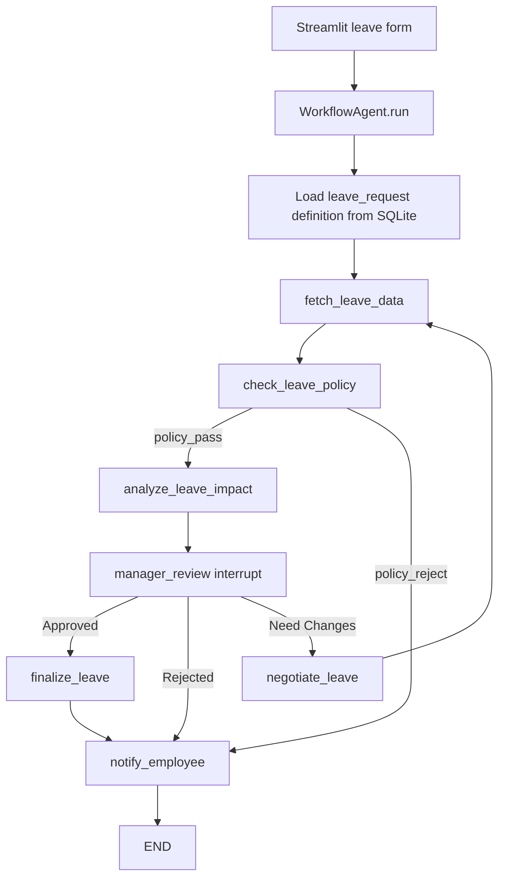

# GraphPilot project walkthrough

This document explains the project by following one employee leave request from the Streamlit form to the final employee notification. It is intended as a code-reading guide: each stage names the user action, LangGraph node, database call, state changes, and edge that runs next.

## Scenario

Use the seeded data below in the Streamlit UI:

| Field | Value |
| --- | --- |
| Tenant | `Demo tenant` (`demo-tenant`) |
| Workflow | `Employee leave request` (`leave_request`) |
| Employee ID | `EMP-1001` |
| Employee | Ava Sharma |
| Manager | Jordan Lee |
| Department | Engineering |
| Leave type | `Vacation` |
| Requested dates | `2026-12-15` |
| Available Vacation balance | 15 days |
| Team conflict | 2 teammates out for the Quarterly platform release; `HIGH` risk |

The example date is useful because it is within Ava's balance but also appears in the seeded team calendar. That means the request passes policy and reaches the manager review gate with a meaningful project-impact warning.

## High-level architecture



## 1. The application starts

**User action:** Run the application with `./run.sh` and open the Streamlit URL.

**Code path:**

1. [run.sh](run.sh) activates `.venv` and runs `python -m streamlit run streamlit_app.py`.
2. [streamlit_app.py](streamlit_app.py) calls `st.set_page_config()` and creates cached resources with `get_database()` and `get_agent()`.
3. `get_database()` constructs `WorkflowDatabase()`.
4. `WorkflowDatabase.__init__()` selects `GRAPHPILOT_DB_PATH` when set, otherwise uses `graphpilot.db`.
5. `WorkflowDatabase.initialize()` executes the SQLite schema and calls `_seed()`.

**Database work:** The first initialization creates the tables and seeds:

- `demo-tenant` and `enterprise-tenant` in `tenants`.
- Ava Sharma and Noah Patel in `employees`.
- Leave balances in `leave_balances`.
- Team calendar entries in `team_calendar`.
- System and tenant-scoped `leave_request` definitions in `workflow_definitions`.
- The leave graph's nodes in `workflow_nodes`.
- The leave graph's edges in `workflow_edges`.

The seed operation is idempotent, so restarting the application does not duplicate the dummy data.

## 2. The user fills in the leave request

**User action:** In the sidebar, select:

- Tenant: `Demo tenant`
- Workflow: `Employee leave request`
- Employee ID: `EMP-1001`
- Leave type: `Vacation`
- Date: `2026-12-15`
- Reason: any short explanation

**Code path:** In [streamlit_app.py](streamlit_app.py):

1. The workflow selector maps `Employee leave request` to `workflow_key = "leave_request"`.
2. The date widget returns Python dates, which are converted to ISO strings such as `"2026-12-15"`.
3. The form values are assembled as:

```python
{
    "employee_id": "EMP-1001",
    "leave_type": "Vacation",
    "requested_dates": ["2026-12-15"],
    "question": "Personal leave request."
}
```

4. Clicking **Start workflow** creates a request ID such as `run-a1b2c3d4`.
5. The UI calls `get_agent("demo-tenant", "leave_request").run(request_id, **form_values)`.

## 3. The agent loads the configured graph

**Code path:** In [workflow_engine.py](workflow_engine.py), `WorkflowAgent.__init__()`:

1. Stores the tenant and workflow key.
2. Calls `database.get_definition("leave_request", "demo-tenant")`.
3. The SQL query prefers a tenant-scoped definition over a system-scoped definition.
4. For this scenario it selects the `TENANT` definition named `Demo tenant leave orchestration workflow`.
5. `build_workflow()` reads every row from `workflow_nodes` and `workflow_edges`.
6. Each database `handler_key` is resolved through the allowlisted `HANDLERS` dictionary.
7. LangGraph `StateGraph` is compiled with `MemorySaver` as the checkpointer.

This is why the graph topology is configurable in SQLite while executable code remains controlled by the handler registry.

## 4. Initial state is created

`WorkflowAgent.run()` starts LangGraph with a `WorkflowState` containing the request metadata and submitted values:

```python
{
    "request_id": "run-a1b2c3d4",
    "tenant_id": "demo-tenant",
    "workflow_key": "leave_request",
    "workflow_definition_id": 2,
    "question": "Personal leave request.",
    "employee_id": "EMP-1001",
    "leave_type": "Vacation",
    "requested_dates": ["2026-12-15"],
    "execution_trace": []
}
```

The call uses `thread_id = request_id`. That ID ties the paused graph state to the later manager resume action.

## 5. `fetch_leave_data` node

**Node function:** `fetch_leave_data()` in [workflow_engine.py](workflow_engine.py).

**Database calls:**

1. `database.get_employee("demo-tenant", "EMP-1001")` reads Ava's employee record from `employees`.
2. `database.get_leave_balance("EMP-1001", "Vacation")` reads `15` from `leave_balances`.
3. `database.get_team_calendar("demo-tenant", "Engineering", ["2026-12-15"])` reads the seeded project conflict from `team_calendar`.

**State added:**

```python
{
    "employee_data": {
        "employee_id": "EMP-1001",
        "employee_name": "Ava Sharma",
        "manager_name": "Jordan Lee",
        "department": "Engineering"
    },
    "available_balance": 15,
    "team_calendar": [
        {
            "leave_date": "2026-12-15",
            "employee_count": 2,
            "project_name": "Quarterly platform release",
            "risk_level": "HIGH"
        }
    ]
}
```

The configured edge is `fetch_leave_data -> check_leave_policy`.

## 6. `check_leave_policy` node

**Node function:** `check_leave_policy()`.

The node calculates:

```python
requested_days = len(requested_dates)  # 1
available_balance = 15
```

Since `1 <= 15`, the node writes:

```python
{
    "policy_status": "APPROVED_FOR_REVIEW",
    "policy_reason": "The request is within the available leave balance."
}
```

**Conditional edge:** `build_workflow()` creates a route function for this node:

- `APPROVED_FOR_REVIEW` returns the database edge key `policy_pass`.
- Any rejected policy result returns `policy_reject`.

For this request, `policy_pass` routes to `analyze_leave_impact`.

## 7. `analyze_leave_impact` node

**Node function:** `analyze_leave_impact()`.

This node turns the `team_calendar` rows into a human-readable summary:

```text
2 teammate(s) are already out on 2026-12-15 for Quarterly platform release (HIGH risk)
```

It stores that value in `project_impact_summary` and appends a message to `execution_trace`.

The configured edge then moves to `manager_review`.

## 8. `manager_review` node and LangGraph interrupt

**Node function:** `manager_review()`.

The node builds a review payload containing:

- Employee and manager names.
- Leave type and dates.
- Available balance.
- Policy reason.
- Project impact summary.
- Allowed decisions: `Approved`, `Rejected`, `Need Changes`.

It then calls LangGraph's `interrupt(payload)`.

At this point:

1. LangGraph pauses execution.
2. `MemorySaver` stores the state under the request's thread ID.
3. `WorkflowAgent.run()` converts the interrupt value into `review_payload`.
4. The UI receives a result with `status = "WAITING_FOR_REVIEW"`.
5. Streamlit renders the manager review controls.

No final leave decision has been made yet. This is the human-in-the-loop boundary.

## 9. Manager chooses `Approved`

**User action:** The manager selects `Approved`, enters notes such as `Coverage confirmed`, and clicks **Submit review**.

**Code path:**

1. `streamlit_app.py` calls `WorkflowAgent.resume(request_id, decision, notes)`.
2. `WorkflowAgent.resume()` sends `Command(resume={"decision": "Approved", "notes": ...})` to the same LangGraph thread.
3. LangGraph resumes at the interrupted `manager_review` node.
4. The node writes `manager_decision = "Approved"` and `reviewer_notes`.
5. The route function returns `Approved`.
6. The database edge `Approved -> finalize_leave` is selected.

## 10. `finalize_leave` node

**Node function:** `finalize_leave()`.

The node creates the final business result:

```python
{
    "final_answer": "Leave request approved for Ava Sharma.",
    "status": "APPROVED"
}
```

The configured edge sends the state to `notify_employee`.

## 11. `notify_employee` node

**Node function:** `notify_employee()`.

For an approved request, it creates:

```text
Your Vacation leave request for 2026-12-15 was approved.
```

It stores that text in `notification_draft`, appends the completion trace, and routes to `END`.

The current project prepares the notification text; it does not send email or Slack. A production adapter could replace this handler or call an external notification service.

## 12. Persistence after completion

After LangGraph returns, `WorkflowAgent.resume()` persists the lifecycle records through `WorkflowDatabase`:

- `save_review()` inserts the manager decision and notes into `review_actions`.
- `save_run()` upserts the request state into `workflow_runs`.
- `save_run()` writes execution trace entries to `workflow_events`.

For the knowledge workflow, the UI also calculates and stores an evaluation in `evaluations`. The leave workflow currently focuses on policy and approval outcomes rather than RAG scoring.

## Alternative branch: policy rejection

Use the same employee but select more than 15 Vacation dates.

The path becomes:

```text
fetch_leave_data
  -> check_leave_policy
  -> policy_reject
  -> notify_employee
  -> END
```

`manager_review` is never called. The notification explains that the request exceeds the available balance, and the final state is `REJECTED`.

## Alternative branch: manager requests changes

Start with `2026-12-15`, then choose `Need Changes` and submit revised dates such as `2026-12-22`.

The path becomes:

```text
manager_review
  -> negotiate_leave
  -> fetch_leave_data
  -> check_leave_policy
  -> analyze_leave_impact
  -> manager_review
```

This is the workflow cycle. The revised dates are injected into the resumed state, then employee balance and team calendar are fetched again before the manager sees a new review payload. The same request ID and LangGraph checkpoint continue the same workflow journey.

## Where to read each responsibility

| Responsibility | File | Main symbols |
| --- | --- | --- |
| Streamlit input and review UI | [streamlit_app.py](streamlit_app.py) | `get_database`, `get_agent`, sidebar form, review controls |
| Workflow state and graph compilation | [workflow_engine.py](workflow_engine.py) | `WorkflowState`, `build_workflow`, `HANDLERS` |
| Leave business nodes | [workflow_engine.py](workflow_engine.py) | `fetch_leave_data`, `check_leave_policy`, `analyze_leave_impact`, `manager_review`, `negotiate_leave`, `finalize_leave`, `notify_employee` |
| SQLite schema and seed data | [database.py](database.py) | `SCHEMA`, `_seed`, `_seed_employees`, `_seed_leave_definition` |
| HR data access | [database.py](database.py) | `get_employee`, `get_leave_balance`, `get_team_calendar` |
| Durable run audit | [database.py](database.py) | `save_run`, `save_review`, `save_evaluation` |
| End-to-end behavior tests | [test_workflow.py](test_workflow.py) | `test_leave_workflow_approves_and_notifies_employee`, `test_leave_policy_rejection_bypasses_manager`, `test_leave_need_changes_loops_back_with_revised_dates` |

## Suggested code-reading order

1. Read the leave graph rows in `_seed_leave_definition()` in [database.py](database.py).
2. Read `WorkflowState` and `HANDLERS` in [workflow_engine.py](workflow_engine.py).
3. Read `build_workflow()` to see how rows become LangGraph nodes and edges.
4. Read the seven leave handler functions in graph order.
5. Read `WorkflowAgent.run()` and `WorkflowAgent.resume()` to understand interrupt and checkpoint behavior.
6. Read the sidebar and review sections in [streamlit_app.py](streamlit_app.py).
7. Run the focused tests with:

```sh
.venv/bin/pytest -q test_workflow.py
```

The tests provide executable examples of approval, policy rejection, and negotiation loop behavior.
