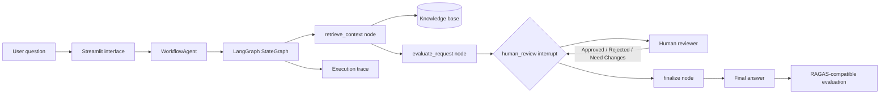

# GraphPilot: AI Workflow Evaluation Lab

GraphPilot is a generic, local-first reference project that demonstrates how to build an end-to-end AI solution with LangGraph. It intentionally avoids a business domain so the architecture can be discussed safely in engineering demos.

The application supports two database-configured workflows: a knowledge question workflow and an employee leave orchestration workflow. The leave workflow accepts employee details and dates, checks policy, analyzes team impact, pauses for manager approval, supports a date negotiation loop, finalizes the decision, and prepares an employee notification.

## Why This Project Exists

This project is designed to demonstrate practical AI engineering skills, not just a prompt or a notebook:

- Designing a graph with explicit nodes and edges.
- Passing typed state through a multi-step workflow.
- Building retrieval-augmented generation concepts.
- Adding a human-in-the-loop approval gate before publishing an answer.
- Orchestrating an HR leave request from submission through policy, impact, approval, negotiation, and notification.
- Persisting workflow configuration, runs, reviews, and evaluations in SQLite.
- Resolving system defaults and tenant-specific workflow versions.
- Measuring answer quality with groundedness and relevance metrics.
- Exposing the complete system through a usable Streamlit interface.
- Keeping the architecture local, deterministic, explainable, and easy to run.

## What a User Sees

A user enters a question such as:

> What is our availability target and how is customer data protected?

The application then:

1. Finds relevant statements in its knowledge base.
2. Builds a draft answer from those statements.
3. Shows the question, sources, and draft to a reviewer.
4. Pauses until the reviewer chooses `Approved`, `Rejected`, or `Need Changes`.
5. Publishes the appropriate final result.
6. Displays evaluation scores and the workflow execution trace.

The approval pause is deliberate. In a real AI product, a human may need to review an answer before it is published, sent to a customer, or used to trigger an action.

## End-to-End Architecture



### The architecture in plain language

- **Streamlit** is the visible application. It handles input, review controls, results, metrics, and trace display.
- **WorkflowAgent** is the application service. It starts a workflow and resumes the same workflow after review.
- **LangGraph** is the state-machine engine. Nodes perform work and edges determine what happens next.
- **SQLite** stores tenants, workflow definitions, nodes, edges, knowledge, runs, reviews, events, and evaluations.
- **Knowledge base** is seeded with system facts and tenant-specific dummy data.
- **Human review** is a first-class graph step. The workflow stops instead of silently publishing a draft.
- **Evaluation** checks whether the final answer is grounded in retrieved context and relevant to the question.

## Graph Design: Nodes and Edges

The graph has four nodes:

| Node | Responsibility |
| --- | --- |
| `retrieve_context` | Ranks local knowledge statements against words in the question and returns relevant context. |
| `evaluate_request` | Creates a grounded draft answer and records initial evaluation state. |
| `human_review` | Builds a review payload and interrupts the graph until a human decision is supplied. |
| `finalize` | Publishes the draft, rejects it, or marks it for revision based on the review decision. |

The edges are:

```text
START -> retrieve_context -> evaluate_request -> human_review
human_review -> finalize -> END
```

The `human_review` node has a conditional edge function. The current demo routes all three decisions to `finalize`, while the final answer changes according to the decision. This keeps the graph easy to extend with different routing policies later.

## Human-in-the-Loop Behavior

Human-in-the-loop means the AI workflow can stop and wait for a person. The workflow does not treat the generated draft as automatically trustworthy.

When the review node runs:

1. It creates a payload containing the question, draft answer, retrieved sources, and evaluation state.
2. LangGraph raises an interrupt and stores the current state in its checkpointer.
3. Streamlit renders the review screen.
4. The reviewer selects a decision and writes notes.
5. The agent resumes the same thread using the reviewer input.
6. The graph continues to the finalization node.

This pattern is useful for content approval, high-risk actions, customer support escalation, document publication, and agent tool authorization.

## Employee Leave Workflow

Choose **Employee leave request** in the Streamlit sidebar, select a tenant, enter an employee ID, choose `Vacation` or `Sick`, select one or more dates, and start the workflow. The seeded demo employee is `EMP-1001` for `demo-tenant`.

The leave state includes:

```python
employee_id, leave_type, requested_dates
available_balance, employee_data, team_calendar
policy_status, policy_reason, project_impact_summary
manager_decision, notification_draft
```

The database-configured leave graph is:

```text
START
  -> fetch_leave_data
  -> check_leave_policy
      -> policy_reject -> notify_employee -> END
      -> policy_pass -> analyze_leave_impact
                    -> manager_review
                        -> Approved -> finalize_leave -> notify_employee -> END
                        -> Rejected -> notify_employee -> END
                        -> Need Changes -> negotiate_leave
                                         -> fetch_leave_data (loop)
```

The policy node automatically rejects requests longer than the employee's available balance. Requests within policy pause at `manager_review`; the reviewer sees the balance, dates, policy result, and project impact. Selecting `Need Changes` and providing revised dates resumes the graph, re-fetches data, rechecks policy, and returns to the manager gate.

Seeded leave data is stored in `employees`, `leave_balances`, and `team_calendar`. Add employees and balances with parameterized SQL or extend `WorkflowDatabase` for production integrations with an HRIS and project calendar service.

## RAG and Evaluation

This project demonstrates the core RAG pattern:

```text
Question -> Retrieve context -> Generate grounded answer -> Evaluate answer
```

`evaluation.py` exposes `evaluate_response()`. It calculates transparent local metrics:

- **Faithfulness**: how much of the answer vocabulary is found in retrieved context.
- **Answer relevancy**: how much of the question vocabulary appears in the answer.
- **Overall score**: the average of the two metrics.

The evaluator also checks whether `ragas` is installed. When available, the result reports `ragas_available: true`, making the integration point visible to interviewers. The local fallback remains deterministic so the demo does not require an LLM provider, API key, or network service.

For a production implementation, this adapter can be expanded to use RAGAS datasets and metrics such as faithfulness, answer relevancy, context precision, and context recall with model-backed evaluators.

## Project Files

| File | Purpose |
| --- | --- |
| `streamlit_app.py` | User interface for running the graph, reviewing the draft, and viewing evaluation results. |
| `workflow_engine.py` | Builds LangGraph graphs from database nodes and edges, resolves handlers, and runs tenant workflows. |
| `database.py` | SQLite schema, idempotent seed data, tenant/workflow resolution, and lifecycle persistence. |
| `PROJECT_WALKTHROUGH.md` | Stage-by-stage code walkthrough of one employee leave request, including nodes, edges, database calls, interrupts, and branches. |
| `evaluation.py` | RAGAS detection and deterministic local evaluation metrics. |
| `requirements.txt` | Streamlit, LangGraph, LangChain Core, RAGAS, Pydantic, and typing dependencies. |
| `run.sh` | Creates a virtual environment, installs dependencies, and launches Streamlit. |
| `test_workflow.py` | Regression test covering graph pause/resume and evaluation output. |

## Querying and Updating Tables

The app creates `graphpilot.db` on first start and seeds two tenants (`demo-tenant` and `enterprise-tenant`), system knowledge, a system `qa_review` workflow, and a tenant-specific `qa_review` override. Set `GRAPHPILOT_DB_PATH` to use another SQLite file. LangGraph's in-memory checkpointer still handles pause/resume state for the running process; SQLite records the durable workflow audit trail and configuration.

### Tenant and workflow resolution

Workflow definitions are versioned and scoped as either `SYSTEM` or `TENANT`. For a requested workflow key, the engine selects the active highest version for that tenant first, then falls back to the active system version. Nodes reference allowlisted handler keys and store JSON configuration; edges store the graph topology and optional condition keys. This lets the same engine host different workflow types and tenant-specific variants without hard-coding each graph's topology.

Create additional definitions through `WorkflowDatabase.create_workflow_definition()` or by inserting matching rows into `workflow_definitions`, `workflow_nodes`, and `workflow_edges`. A custom handler must be registered in `workflow_engine.py` before it can be referenced by a node; this prevents arbitrary database values from executing code.

### Example schema

```sql
CREATE TABLE knowledge_items (
    id INTEGER PRIMARY KEY,
    statement TEXT NOT NULL,
    active INTEGER NOT NULL DEFAULT 1
);

CREATE TABLE workflow_runs (
    request_id TEXT PRIMARY KEY,
    question TEXT NOT NULL,
    status TEXT NOT NULL,
    reviewer_decision TEXT,
    reviewer_notes TEXT,
    final_answer TEXT
);
```

The complete schema also includes `tenants`, `workflow_nodes`, `workflow_edges`, `workflow_events`, `review_actions`, and `evaluations`. Foreign keys, uniqueness constraints, scope checks, and indexes are enabled by `database.py`.

### Query tables

List active knowledge statements:

```sql
SELECT id, statement
FROM knowledge_items
WHERE active = 1
ORDER BY id;
```

Find completed runs that were approved:

```sql
SELECT request_id, question, final_answer
FROM workflow_runs
WHERE status = 'COMPLETED'
  AND reviewer_decision = 'Approved'
ORDER BY request_id;
```

Count runs by status:

```sql
SELECT status, COUNT(*) AS run_count
FROM workflow_runs
GROUP BY status
ORDER BY run_count DESC;
```

### Insert and update values

Add a new knowledge statement:

```sql
INSERT INTO knowledge_items (statement)
VALUES ('Critical production changes require an approved rollback plan.');
```

Update a statement by its primary key:

```sql
UPDATE knowledge_items
SET statement = 'Our service target is 99.95 percent monthly availability.'
WHERE id = 1;
```

Deactivate a statement without deleting it:

```sql
UPDATE knowledge_items
SET active = 0
WHERE id = 1;
```

Record reviewer information for a workflow run using parameters supplied by the application:

```sql
UPDATE workflow_runs
SET reviewer_decision = ?,
    reviewer_notes = ?,
    status = 'COMPLETED',
    final_answer = ?
WHERE request_id = ?;
```

Use parameterized statements for values supplied by users or model output. Do not build SQL by concatenating the question, reviewer notes, or other request data into the query string.

## Running Locally

From the project folder:

```sh
./run.sh
```

Open the address printed by Streamlit, normally:

```text
http://localhost:8501
```

The first run may take a little longer because `run.sh` creates `.venv` and installs dependencies.

The sidebar tenant selector demonstrates configuration resolution. `demo-tenant` uses its tenant-scoped workflow definition; `enterprise-tenant` falls back to the system definition. Completed runs, reviewer actions, execution trace events, and evaluation metrics are written to `graphpilot.db`.

Run the automated workflow test with:

```sh
.venv/bin/pytest -q test_workflow.py
```

## Interview Demo Script

1. Start the application with `./run.sh`.
2. Explain that the interface is the front end of a graph, not a single prompt.
3. Submit the default question.
4. Point out the retrieved context and grounded draft.
5. Explain that the graph has paused at `human_review`.
6. Approve the answer and add reviewer notes.
7. Show the final answer, faithfulness, relevancy, overall score, and execution trace.
8. Run the flow again and choose `Rejected` or `Need Changes` to demonstrate conditional business behavior.

## How to Discuss the Code

A strong walkthrough can follow this sequence:

### State

`WorkflowState` is the shared contract carried across nodes. It contains the request ID, question, retrieved context, draft answer, evaluation data, reviewer decision, final answer, status, and trace.

### Nodes

Each node has one responsibility and returns a state update. This makes the workflow observable, testable, and easier to change than one large function.

### Edges

Edges define the control flow. The graph starts with retrieval, moves through drafting, pauses for review, and finishes with finalization.

### Checkpointing

`MemorySaver` stores the interrupted state by request ID during the process. SQLite stores the selected definition ID and durable run, event, review, and evaluation records so the operational history can be queried independently.

### Evaluation

Evaluation is placed after finalization so the demo can measure the answer that would actually be shown to a user. In a larger system, evaluation can run offline over a test set and in production as observability telemetry.
