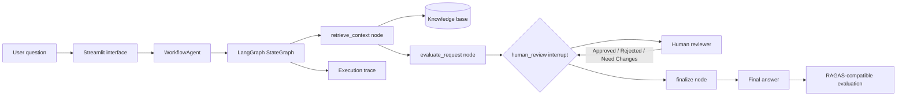

# GraphPilot: AI Workflow Evaluation Lab

GraphPilot is a generic, local-first reference project that demonstrates how to build an end-to-end AI solution with LangGraph. It intentionally avoids a business domain so the architecture can be discussed safely in engineering demos.

The application accepts a user question, retrieves supporting knowledge, creates a grounded draft, pauses for human review, finalizes the response, and evaluates the result. It runs in Streamlit and uses a small deterministic knowledge base so the full workflow is easy to inspect and reproduce.

## Why This Project Exists

This project is designed to demonstrate practical AI engineering skills, not just a prompt or a notebook:

- Designing a graph with explicit nodes and edges.
- Passing typed state through a multi-step workflow.
- Building retrieval-augmented generation concepts.
- Adding a human-in-the-loop approval gate before publishing an answer.
- Persisting workflow checkpoints in memory for resume behavior.
- Measuring answer quality with groundedness and relevance metrics.
- Exposing the complete system through a usable Streamlit interface.
- Keeping the architecture local, deterministic, explainable, and easy to run.

## What a User Sees

A user enters a question such as:

> What is our availability target and how is customer data protected?

The application then:

1. Finds relevant statements in its knowledge base.
2. Builds a draft answer from those statements.
3. Shows the question, sources, and draft to a reviewer.
4. Pauses until the reviewer chooses `Approved`, `Rejected`, or `Need Changes`.
5. Publishes the appropriate final result.
6. Displays evaluation scores and the workflow execution trace.

The approval pause is deliberate. In a real AI product, a human may need to review an answer before it is published, sent to a customer, or used to trigger an action.

## End-to-End Architecture



### The architecture in plain language

- **Streamlit** is the visible application. It handles input, review controls, results, metrics, and trace display.
- **WorkflowAgent** is the application service. It starts a workflow and resumes the same workflow after review.
- **LangGraph** is the state-machine engine. Nodes perform work and edges determine what happens next.
- **Knowledge base** is the source of truth for the demo. It is intentionally small and local.
- **Human review** is a first-class graph step. The workflow stops instead of silently publishing a draft.
- **Evaluation** checks whether the final answer is grounded in retrieved context and relevant to the question.

## Graph Design: Nodes and Edges

The graph has four nodes:

| Node | Responsibility |
| --- | --- |
| `retrieve_context` | Ranks local knowledge statements against words in the question and returns relevant context. |
| `evaluate_request` | Creates a grounded draft answer and records initial evaluation state. |
| `human_review` | Builds a review payload and interrupts the graph until a human decision is supplied. |
| `finalize` | Publishes the draft, rejects it, or marks it for revision based on the review decision. |

The edges are:

```text
START -> retrieve_context -> evaluate_request -> human_review
human_review -> finalize -> END
```

The `human_review` node has a conditional edge function. The current demo routes all three decisions to `finalize`, while the final answer changes according to the decision. This keeps the graph easy to extend with different routing policies later.

## Human-in-the-Loop Behavior

Human-in-the-loop means the AI workflow can stop and wait for a person. The workflow does not treat the generated draft as automatically trustworthy.

When the review node runs:

1. It creates a payload containing the question, draft answer, retrieved sources, and evaluation state.
2. LangGraph raises an interrupt and stores the current state in its checkpointer.
3. Streamlit renders the review screen.
4. The reviewer selects a decision and writes notes.
5. The agent resumes the same thread using the reviewer input.
6. The graph continues to the finalization node.

This pattern is useful for content approval, high-risk actions, customer support escalation, document publication, and agent tool authorization.

## RAG and Evaluation

This project demonstrates the core RAG pattern:

```text
Question -> Retrieve context -> Generate grounded answer -> Evaluate answer
```

`evaluation.py` exposes `evaluate_response()`. It calculates transparent local metrics:

- **Faithfulness**: how much of the answer vocabulary is found in retrieved context.
- **Answer relevancy**: how much of the question vocabulary appears in the answer.
- **Overall score**: the average of the two metrics.

The evaluator also checks whether `ragas` is installed. When available, the result reports `ragas_available: true`, making the integration point visible to interviewers. The local fallback remains deterministic so the demo does not require an LLM provider, API key, or network service.

For a production implementation, this adapter can be expanded to use RAGAS datasets and metrics such as faithfulness, answer relevancy, context precision, and context recall with model-backed evaluators.

## Project Files

| File | Purpose |
| --- | --- |
| `streamlit_app.py` | User interface for running the graph, reviewing the draft, and viewing evaluation results. |
| `workflow_engine.py` | Typed graph state, knowledge base, nodes, edges, interrupt handling, and `WorkflowAgent`. |
| `evaluation.py` | RAGAS detection and deterministic local evaluation metrics. |
| `requirements.txt` | Streamlit, LangGraph, LangChain Core, RAGAS, Pydantic, and typing dependencies. |
| `run.sh` | Creates a virtual environment, installs dependencies, and launches Streamlit. |
| `test_workflow.py` | Regression test covering graph pause/resume and evaluation output. |

## Running Locally

From the project folder:

```sh
./run.sh
```

Open the address printed by Streamlit, normally:

```text
http://localhost:8501
```

The first run may take a little longer because `run.sh` creates `.venv` and installs dependencies.

Run the automated workflow test with:

```sh
.venv/bin/pytest -q test_workflow.py
```

## Interview Demo Script

1. Start the application with `./run.sh`.
2. Explain that the interface is the front end of a graph, not a single prompt.
3. Submit the default question.
4. Point out the retrieved context and grounded draft.
5. Explain that the graph has paused at `human_review`.
6. Approve the answer and add reviewer notes.
7. Show the final answer, faithfulness, relevancy, overall score, and execution trace.
8. Run the flow again and choose `Rejected` or `Need Changes` to demonstrate conditional business behavior.

## How to Discuss the Code

A strong walkthrough can follow this sequence:

### State

`WorkflowState` is the shared contract carried across nodes. It contains the request ID, question, retrieved context, draft answer, evaluation data, reviewer decision, final answer, status, and trace.

### Nodes

Each node has one responsibility and returns a state update. This makes the workflow observable, testable, and easier to change than one large function.

### Edges

Edges define the control flow. The graph starts with retrieval, moves through drafting, pauses for review, and finishes with finalization.

### Checkpointing

`MemorySaver` stores the interrupted state by request ID. Resume uses the same request ID, which is how the application knows which workflow to continue.

### Evaluation

Evaluation is placed after finalization so the demo can measure the answer that would actually be shown to a user. In a larger system, evaluation can run offline over a test set and in production as observability telemetry.
